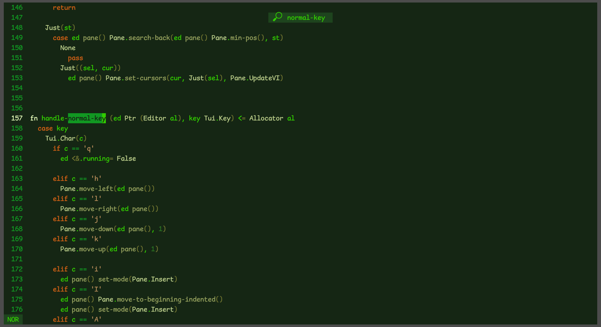

# kd - kind of an editor

my attempt at an editor written in [kc](https://github.com/bingis-khan/kkc). attempts to emulate helix control scheme.

## ideas

- cute, 60 FPS animation near or around the cursor when switching from Normal to Insert and back. (should make a special animation subsystem, which we can query if any animation is playing to check if we need to redraw)
- animations in general
  - opening the editor on a file causes letters to appear from left to right in half a sec.
  - background slowly fills the screen from top-left/center corner/ randomly fills in half a sec(tm) when the editor is opened.

## todo

- [x] searching + wrapping (fwd and bwd)
- [x] editor messages (send message Str -> () which allocates and frees n stuff)
- [x] SELECT mode
- [x] copy-paste (at deletion + when pressed y)
- [x] indent dedent
- [ ] `g` and `<space>` submenu
- [ ] undo/redo
- ...
- [ ] filepicker (which respects .ignore and .gitignore) (will require more std functions.)
- ...
- [ ] syntax (keyword) highlighting
- ...
- [ ] nice UI and animations
- [ ] multipane
- [ ] multicursor
- ...
- [ ] nice themes
- [ ] cmd autocomplete
- [ ] wq (i didn't add it on purpose. due to my muscle memory, i use it automatically,  but I don't want to overwrite important files accidentally)
